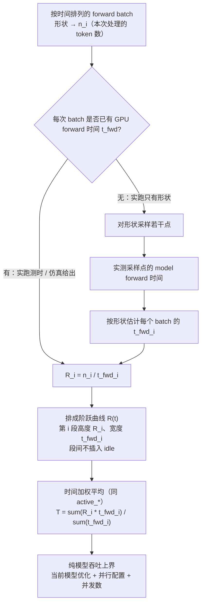

# Agent任务下Prefill/Decode节点吞吐估计

先约定 AIPerf 的吞吐口径（客户端墙钟，不区分 PD / aggregated），再给出两种估计：按 request 形状分布的 serving 吞吐，以及按 forward batch 还原的纯模型上界。

## AIPerf吞吐计算方式

AIPerf 是**客户端**指标：只看见「发请求 → 首 token → 最后一个 chunk」，不知道后面是 PD 分离还是 aggregated。公共时间窗 $T$ = 最后一条响应结束 − 第一条请求发出（warmup 不进账）。分子默认是客户端 tokenizer 的 ISL/OSL；`--use-server-token-count` 才用服务端 `usage`。

整段墙钟（分母含 TTFT / 排队 / ramp-drain）：

$$
\texttt{input\_token\_throughput} = \frac{\sum \mathrm{ISL}}{T},\quad
\texttt{output\_token\_throughput} = \frac{\sum \mathrm{OSL}}{T},\quad
\texttt{total\_token\_throughput} = \frac{\sum\mathrm{ISL}+\sum\mathrm{OSL}}{T}
$$

按请求切阶段（首 token 为界；ITL **不含** TTFT；OSL $=1$ 时 ITL 无定义）：

$$
\mathrm{TTFT}=t_{\text{first}}-t_{\text{send}},\quad
\mathrm{ITL}=\frac{\text{latency}-\mathrm{TTFT}}{\mathrm{OSL}-1}
$$

$$
\text{prefill TPS/user}=\frac{\mathrm{ISL}}{\mathrm{TTFT}},\quad
\text{output TPS/user}=\frac{1}{\mathrm{ITL}}
$$

这两个是 **per-user**（一条请求 = 一个 user），不是整机吞吐。`prefill TPS/user`（AIPerf 的 `prefill_throughput_per_user`）表示：从发出请求到看到首 token，这条请求平均每秒「处理了」多少个 prompt token。并发 $C$ 时 AIPerf 对 $C$ 条各算一个数，再报 avg / p50 / p99 等**分布**，不把它们加总。并发升高时 per-user 通常下降，系统级 `input_token_throughput` $=\sum\mathrm{ISL}/T$ 通常上升直到饱和。

TTFT 是客户端等到**第一个输出 token 送达**的时间，不等于 GPU prefill kernel 时间：里面还有排队、网络；PD 下还有 KV 传输和 frontend 转发。第一个输出 token 的 logits 通常是 **prefill 最后位置**算出来再 sample 的，不是一次 decode-shaped forward（ATOM PD 里 Prefill 算出并 sample 出 T0 再交给 Decode，Decode 的第一次 decode step 生成的是后续 token）。AIPerf 只是把「等到这个 token」的整段时间记在 TTFT 里，ITL 从第二个输出 token 才开始（分母 $\mathrm{OSL}-1$）。有 prefix cache 时分子仍用完整 ISL，命中的那截会被算进吞吐，数字会虚高。所以它是「用户等到首 token 有多快」的代理，不是 Prefill 节点的纯 kernel tok/s。`output TPS/user` 同理：单条请求稳态生成速度 $1/\mathrm{ITL}$，和分母含 TTFT 的系统级 `output_token_throughput` 不可直接比。

扫描线把「每条请求自己的时间段」叠成一条**阶跃的瞬时系统吞吐曲线**，再对时间平均。`effective_*` 和 `active_*` 用同一条曲线，差别只在平均时包不包空窗。

**1. 每条请求先切成两段，段内速率恒定（匀速假设）**

对请求 $k$，客户端三个时刻：$t^{\mathrm{send}}_k$（发出）、$t^{\mathrm{first}}_k$（收到第一个输出 token）、$t^{\mathrm{end}}_k$（收到最后一个 chunk）。

$$
r^{\mathrm{prefill}}_k = \frac{\mathrm{ISL}_k}{t^{\mathrm{first}}_k - t^{\mathrm{send}}_k},\qquad
r^{\mathrm{decode}}_k = \frac{\mathrm{OSL}_k - 1}{t^{\mathrm{end}}_k - t^{\mathrm{first}}_k}
$$

请求 $k$ 只在 $[t^{\mathrm{send}}_k, t^{\mathrm{first}}_k)$ 给系统贡献 $r^{\mathrm{prefill}}_k$，只在 $[t^{\mathrm{first}}_k, t^{\mathrm{end}}_k)$ 贡献 $r^{\mathrm{decode}}_k$，其它时刻贡献 0。段内不随真实 kernel 快慢变化。

**2. 所有请求的开关事件排成一条时间线，相邻时刻之间瞬时值不变**

每条请求在两条扫描线上各有一对加减：

* Prefill：在 $t^{\mathrm{send}}$ 把 $r^{\mathrm{prefill}}$ 加进系统，在 $t^{\mathrm{first}}$ 再减掉
* Decode：在 $t^{\mathrm{first}}$ 把 $r^{\mathrm{decode}}$ 加进系统，在 $t^{\mathrm{end}}$ 再减掉

也就是说 $t^{\mathrm{first}}$ 是交接：prefill 段在这一时刻结束，decode 段从这一时刻开始。同一时刻若既有「减」又有「加」，实现里先减后加，所以 $t^{\mathrm{first}}$ 这一瞬间不会把 $r^{\mathrm{prefill}}$ 和 $r^{\mathrm{decode}}$ 叠在同一点上；半开区间 $[t^{\mathrm{send}}, t^{\mathrm{first}})$ 与 $[t^{\mathrm{first}}, t^{\mathrm{end}})$ 也不重叠。全部事件按时间排序后，相邻两个时刻 $[t_i, t_{i+1})$ 上瞬时值不变：

$$
R_{\mathrm{prefill}}(t)=\sum_{k:\, t\in[t^{\mathrm{send}}_k,t^{\mathrm{first}}_k)} r^{\mathrm{prefill}}_k,\qquad
R_{\mathrm{decode}}(t)=\sum_{k:\, t\in[t^{\mathrm{first}}_k,t^{\mathrm{end}}_k)} r^{\mathrm{decode}}_k
$$

瞬时并发 $C_{\mathrm{prefill}}(t)$ / $C_{\mathrm{decode}}(t)$ 同理，只是每个请求贡献 $1$ 而不是 $r$。$R_{\mathrm{total}}(t)=R_{\mathrm{prefill}}(t)+R_{\mathrm{decode}}(t)$（同一时刻可以有的请求还在等首 token、有的已经在收后续 token）。

例：请求 A 在 $[0,2)$ 贡献 $500$ tok/s，请求 B 在 $[1,3)$ 贡献 $300$ tok/s，则

$$
R_{\mathrm{prefill}}(t)=\begin{cases}
500 & t\in[0,1)\\
800 & t\in[1,2)\\
300 & t\in[2,3)\\
0 & \text{其它}
\end{cases}
$$

**3. 对这条阶跃曲线做时间加权平均**

分析窗一般是整段 benchmark $[t_{\min}, t_{\max}]$，长度 $T$。`effective_*` 的分母是整个 $T$（空窗上 $R=0$ 也算进去）：

$$
\texttt{effective\_prefill}=\frac{1}{T}\sum_i R_{\mathrm{prefill}}(t_i)\,\Delta t_i
$$

`active_*` 先用并发当开关：只保留 $C_{\mathrm{phase}}(t)>0$ 的小段，分母改成这些小段时长之和 $T_{\mathrm{active}}$（上例 prefill 的 $T_{\mathrm{active}}=3$，不是整个 $T$）：

$$
\texttt{active\_prefill}=\frac{1}{T_{\mathrm{active}}}\sum_{i:\,C_{\mathrm{prefill}}(t_i)>0} R_{\mathrm{prefill}}(t_i)\,\Delta t_i
$$

上例：`active_prefill` $=(500\cdot1+800\cdot1+300\cdot1)/3=533.3$；若 $T=6$，`effective_prefill` $=1600/6\approx 266.7$。decode 只占墙钟 30% 时，`effective_decode` 大约是 `active_decode` 的 0.3 倍。p50/p90 也是按这些小段的**时长**当权重，不是按请求条数。

对应名字：`effective_prefill_throughput` / `effective_decode_throughput` 是 $R_{\mathrm{prefill}}$ / $R_{\mathrm{decode}}$ 对整个 $T$ 的平均；`effective_total_throughput` 是 $R_{\mathrm{total}}$；`effective_*_concurrency` 是同一套事件上的 $C(t)$。`input_token_throughput` $=\sum\mathrm{ISL}/T$ 不看请求是否重叠；`prefill TPS/user` 是单条的 $r^{\mathrm{prefill}}_k$；扫描线才把多条匀速段按时间叠在一起。

`active_prefill_*` 和 `active_decode_*` **都不是** GPU kernel 时间线，切点都是客户端收包时刻。差别是近似质量：

* `active_prefill_*` 用 $[t^{\mathrm{send}}, t^{\mathrm{first}})$，把整段 TTFT 都当成 prefill。排队、网络、PD 的 KV 传输都在这个窗口里，和 GPU prefill 差得最远。
* `active_decode_*` 用 $[t^{\mathrm{first}}, t^{\mathrm{end}})$，把 $(\mathrm{OSL}-1)$ 个后续 token **匀速**摊在「首 token 送达 → 末 token 送达」上。这更接近 serving 的生成阶段，但仍然是客户端墙钟：含后续 token 的网络/SSE、调度间隔、batch 变化、preemption；ATOM 若把多个 token 打进一个 chunk，窗口按 chunk 到达而不是逐 token kernel。GPU 上 Decode 的第一次 forward 往往在客户端收到 T0 **之前**就开了（T0 还在路上），最后一次 kernel 结束也早于客户端收到最后一个 chunk。要 kernel 时间线只能看 engine trace / HIP event。


**PD 分离**：

* 一次普通 e2e 压测的 input/output tok/s **不是** P/D 节点吞吐：TTFT 里叠了排队 + Prefill（含 sample 出第一个输出 token）+ KV 传输 + frontend 转发。
* 要对齐节点，须隔离测量（见下一节）：Prefill 用 `--osl 1` + prefix/fresh；Decode 用 cache-replay 的 Pass 2。
* 整条 PD 系统：$T_{\text{system}}\approx\min(T_P,T_D,T_{\text{KV-transfer}})$。P 是 input tok/s、D 是 output tok/s，要用「每秒能养多少条请求」再比，不能把两边的 tok/s 相加。

**Aggregated**：

* 同一组 GPU 既做 prefill 又做 decode，总吞吐就是 `total_token_throughput`；瞬时对应 `effective_total_throughput`（忙时用 `active_total_throughput`）。
* 这是客户端看到的混合速率，不是「P 容量 + D 容量」——隔离测到的 $T_P$ 和 $T_D$ 在同一块 GPU 上抢时间，相加会双计。


## 基于 ISL/OSL 分布的估计

核心思想：不还原每一步 forward batch，只看 request 形状在二维网格上的出现频率；测少数代表点，再按格子权重加权，得到该 agent 任务下节点的理想吞吐。

1. **Prefill**：统计 `(context_length, query_length)` 的分布，对覆盖率达到阈值的格子取代表点做定点吞吐测量（`--osl 1`，压掉 decode），再按格子内 request 数加权。  
   方法：[`prefill/Prefill_throughput_statistical_estimation.md`](prefill/Prefill_throughput_statistical_estimation.md)

2. **Decode**：统计 `(ISL, L_ctx)` 的分布，其中 `L_ctx = ISL + OSL/2` 是 decode 过程中上下文的中点。对入选格子测 Decode-dominant 吞吐（两遍 cache-replay），再按格子内 request 数加权。  
   方法：[`decode/Decode_throughput_statistical_estimation.md`](decode/Decode_throughput_statistical_estimation.md)  
   测点脚本：[`decode/standalone_aiperf_decode_cache_replay.md`](decode/standalone_aiperf_decode_cache_replay.md)

两边都是「分箱 → 代表点 → 按覆盖率选格赋权 → 定点实测再加权」。差别在形状定义和测法：Prefill 用 `(c, q)` + 短 OSL；Decode 用 `(ISL, L_ctx)` + cache-replay。测点都要在 aiperf 侧指定同一 `concurrency`，不要把不同并发的点混进同一次加权。

基于上述方法给出的吞吐是 **serving 定点实测再加权**，$T_{ij}$ 来自 AIPerf 客户端墙钟，因此加权结果里除了模型 forward 的 GPU kernel，还包含：

* **调度**：`schedule`、组 batch
* **准备与后处理**：`prepare_model`、KV block 分配、sampling、`postprocess`
* **客户端路径**：HTTP、streaming / SSE、tokenizer；Prefill 用 TTFT / input tok/s，Decode 用 ITL 或 `output_token_throughput`，切点都是收包时刻

按设计**不包含**（或已被测法剥掉）的：

* 真实 agent 流量里「等下一条请求」造成的 idle bubble（测点是固定 $C$ 的合成负载）
* 真实 1P1D 的 P→D KV-transfer / 跨节点路由（Decode 用本机 cache-replay 代替「KV 已在」）

上述方法估计的是**给定调度策略和模型配置**下 Prefill / Decode 节点各自的 serving 吞吐，可据此计算 PD 配比。它不能回答「若改进调度，吞吐还有多大空间」——那需要对照下一节在剔除调度开销后的纯模型上界。


## 基于trace forward batch的拟合估计

如果可以获得模型在某个并行配置下的实际 trace 或仿真 trace，就能得到按时间排列的 forward batch：每个 batch 里有哪些 request、每条 request 已有多少 KV、本步要处理多少 token。据此估计**纯模型吞吐**：在当前模型优化状态 + 并行配置 + 并发数下，只计 GPU `model forward` 的上界。相对上一节的 serving 吞吐，这里按假设已经去掉等请求的 idle，并假定调度 / 准备输入 / 后处理都能和 GPU forward 完美 overlap。

算法和 AIPerf 的 `active_*` 同构，但阶跃曲线的一段对应一次 **forward batch**，而不是一条请求的客户端收包区间：

1. 对第 $i$ 次 forward，瞬时吞吐 $R_i = n_i / t^{\mathrm{fwd}}_i$（$n_i$ 是这次 batch 处理的 token 数，$t^{\mathrm{fwd}}_i$ 是这次的 GPU forward 时间），并在该次 forward 的时长内保持恒定。
2. 把所有 forward 按时间排成一条阶跃曲线（相邻两次 forward 之间不插入 idle）。
3. 对这条曲线做时间加权平均，分母是 $\sum_i t^{\mathrm{fwd}}_i$（只对「有 forward 在跑」的时间平均，对应 `active_*` 而不是含空窗的 `effective_*`）。

$t^{\mathrm{fwd}}_i$ 从哪来，按 trace 里有没有时间分三种：

1. **实跑 trace 带了每次 batch 的 model forward 时间**：用实测 $t^{\mathrm{fwd}}_i$ 直接算 $R_i$，不用估计。
2. **仿真 trace 给出了每次 batch 的形状，以及该形状下的 forward 时间**：同样可以直接算 $R_i$。
3. **实跑 trace 只有每次 batch 的形状，没有 forward 时间**：形状组合太多，无法逐点实测。先测一批采样点的 model forward 时间，再按形状去估计每个 batch 的 $t^{\mathrm{fwd}}_i$，最后得到 $R_i$ 和加权平均。



阶跃曲线示意：每段宽度是该次 GPU forward 时间，段与段紧挨着，中间没有等请求的空隙。

```text
R(t)
  ^
  |  ┌─────┬──────────┬───┐
  |  │ R1  │    R2    │R3 │
  |  └─────┴──────────┴───┘
  +---------------------------> t
     t1_fwd    t2_fwd   t3_fwd

  T = (R1*t1_fwd + R2*t2_fwd + R3*t3_fwd) / (t1_fwd + t2_fwd + t3_fwd)
```

